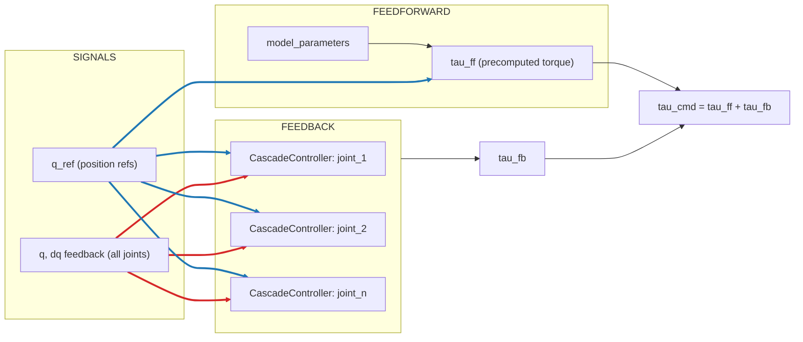
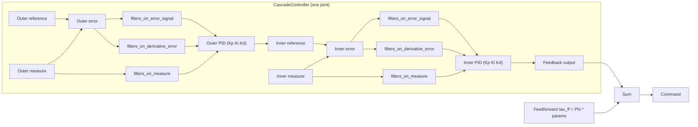

## Overview

This repository contains a collection of MATLAB and Python tools used for the _Laboratorio di Automatica_ course at the [_Università degli Studi di Brescia_](https://www.unibs.it/it). The authors decline any responsibility for usage outside this scope. The provided tools support the development, simulation, and implementation of control systems for mechatronic applications. Developed by [CARI JRL](https://cari.unibs.it/).

## Build Status


## Table of Contents
- [Overview](#overview)
- [Key Features](#key-features)
  - [Filter Classes](#filter-classes)
  - [Controller Classes](#controller-classes)
  - [Motion Law](#motion-law)
- [Robot Model Structure](#robot-model-structure)
- [Control Structure](#control-structure)
- [Simulation](#simulation)
- [Installation](#installation)
  - [Create the Conda environment](#create-the-conda-environment)
  - [Install dependencies](#install-dependencies)
  - [Update the package](#update-the-package)
  - [Platform notes](#platform-notes)
  - [Tips and troubleshooting](#tips-and-troubleshooting)
- [Usage in MATLAB](#usage-in-matlab)

## Key Features

### Filter Classes

- **BaseFilter:** [Base class for filter implementations, providing common functionalities](docs/base_filter.md).
- **FirstOrderLowPassFilter:** [Discrete-time first-order low-pass filter for signal conditioning](docs/first_order_low_pass_filter.md).
- **NotchFilter:** [Discrete-time notch filter for mitigating specific frequency components](docs/notch_filter.md).
- **FIRFilter:** [Discrete-time Finite Impulse Response (FIR) filter for smoothing signals](docs/fir_filter.md).
- **Delay:** [Discrete-time fixed delay](docs/delay.md).

### Controller Classes

- **BaseController:** [Abstract class for designing control laws in mechatronic systems](docs/base_controller.md).
- **PIDController:** [Proportional-Integral-Derivative controller with customizable gains and filtering options](docs/pid_controller.md).
- **CascadeController:** [Cascade control structure combining inner and outer controllers for improved performance](docs/cascade_controller.md).
- **DecentralizedController:** [Decentralized control structure with precomputed torque](docs/decentralized_controller.md).

### Motion Law

- **MotionLaw:** Abstract class for computing motion laws and executing a list of instructions.
- **TrapezoidalMotionLaw:** Class for computing trapezoidal motion laws.

## Robot Model Structure

Each robot folder (for example, `Scara0/`) should contain these files:

- **model.xml** - Robot description.
- **control_config.yaml** - Control parameters.
- **initial_control_config.yaml** - Initial control parameters, typically used during identification.
- **trajectory.txt** - Part program in the custom format, or **trajectory.gcode** in G-code format.
- **tests/** - Folder used to store test results.

## Control Structure

The `DecentralizedController` class is designed for controlling a multi-joint rigid-body robot.

The controller computes a feedforward action (precomputed torque) using a rigid model, and it includes one `CascadeController` for each joint.


```mermaid
flowchart LR
  subgraph DCSIN["SIGNALS"]
    direction TB
    QREF["q_ref (position refs)"]
    QFB["q, dq feedback (all joints)"]
  end

  subgraph FFW["FEEDFORWARD"]
    direction TB
    TAU_FF["tau_ff (precomputed torque)"]
    PARAMS["model_parameters"] --> TAU_FF
  end

  subgraph DCIN["FEEDBACK"]
    direction TB
    C1["CascadeController: joint_1"]
    C2["CascadeController: joint_2"]
    CN["CascadeController: joint_n"]
  end

  QREF --> C1
  QFB --> C1
  QREF --> C2
  QFB --> C2
  QREF --> CN
  QFB --> CN

  DCIN --> TAU_FB["tau_fb"]

  QREF --> TAU_FF

  TAU_FF --> SUM["tau_cmd = tau_ff + tau_fb"]
  TAU_FB --> SUM

  linkStyle 1 stroke:#1f77b4,stroke-width:3px;
  linkStyle 2 stroke:#d62728,stroke-width:3px;
  linkStyle 3 stroke:#1f77b4,stroke-width:3px;
  linkStyle 4 stroke:#d62728,stroke-width:3px;
  linkStyle 5 stroke:#1f77b4,stroke-width:3px;
  linkStyle 6 stroke:#d62728,stroke-width:3px;
  linkStyle 8 stroke:#1f77b4,stroke-width:3px;
```

For each joint, `CascadeController` uses:

- an outer controller for joint position
- an inner controller for joint velocity


```mermaid
flowchart LR
  subgraph J["CascadeController (one joint)"]
    r_out["Outer reference"] --> e_out["Outer error"]
    y_out["Outer measure"] --> e_out

    e_out --> Fes["filters_on_error_signal"]
    y_out --> Fm["filters_on_measure"]
    e_out --> Fde["filters_on_derivative_error"]

    Fes --> PIDo["Outer PID (Kp Ki Kd)"]
    Fm  --> PIDo
    Fde --> PIDo

    PIDo --> r_in["Inner reference"]

    r_in --> e_in["Inner error"]
    y_in["Inner measure"] --> e_in

    e_in --> Fes2["filters_on_error_signal"]
    y_in --> Fm2["filters_on_measure"]
    e_in --> Fde2["filters_on_derivative_error"]

    Fes2 --> PIDi["Inner PID (Kp Ki Kd)"]
    Fm2  --> PIDi
    Fde2 --> PIDi

    PIDi --> u_fb["Feedback output"]
  end

  u_ff["Feedforward tau_ff = Phi * params"] --> sum["Sum"]
  u_fb --> sum
  sum --> u_cmd["Command"]
```

### Control parameters

Control parameters are described as follows:

```yaml
controller:
  cascade_controllers:
    - name: joint1
      inner:
        Kp: 25.0
        Ki: 2.0
        Kd: 0.1
        filters_on_derivative_error:
          - type: FirstOrderLowPassFilter
            time_constant: 0.01
          - type: NotchFilter
            natural_frequency: 60.0
            zeros_damping: 0.05
            poles_damping: 0.2
      outer:
        Kp: 5.0
        Ki: 0.0
        Kd: 0.0
        filters_on_measure:
          - type: FIRFilter
            coefficients: [0.25, 0.5, 0.25]
        filters_on_error_signal:
          - type: FirstOrderLowPassFilter
            time_constant: 0.02
    - name: joint2
      inner:
        Kp: 35.0
        Ki: 2.0
        Kd: 0.1
        filters_on_derivative_error:
          - type: FirstOrderLowPassFilter
            time_constant: 0.01
          - type: NotchFilter
            natural_frequency: 60.0
            zeros_damping: 0.05
            poles_damping: 0.2
      outer:
        Kp: 5.0
        Ki: 0.0
        Kd: 0.0
        filters_on_measure:
          - type: FIRFilter
            coefficients: [0.25, 0.5, 0.25]
        filters_on_error_signal:
          - type: FirstOrderLowPassFilter
            time_constant: 0.02
model_parameters:
  - 0.0
  - 0.0
  # ...
```

See [configuration details](docs/configuration.md) for more information.

## Simulation

- **mechanical_system.py** - Abstract class for simulating mechanical systems.
- **mujoco_robotic_system.py** - Simulates a robot with flexible joints using the Spong model. Reads [MJCF](https://mujoco.readthedocs.io/en/stable/modeling.html) files and configuration data from a robot folder.

## Installation

The recommended installation method is a dedicated [**Conda environment**](https://www.anaconda.com/download/success).

### Create the Conda environment

Create and activate a clean environment:

```bash
conda create -n labauto python=3.11 -y
conda activate labauto
```

You can choose another compatible Python version if needed.

### Install dependencies

Install the required dependencies in the following order:

```bash
conda install -y conda-forge::mujoco-python
conda install -y pinocchio -c conda-forge
conda install -y pyyaml
conda install -y main::aiohttp-jinja2
conda install -y plotly
pip install "git+https://github.com/JRL-CARI-CNR-UNIBS/labauto_control_library#master"
```

### Update the package

To update the package to the latest version from the `master` branch:

```bash
pip install --upgrade "git+https://github.com/JRL-CARI-CNR-UNIBS/labauto_control_library#master"
```

### Platform notes

#### Windows

Use **Anaconda Prompt** or any terminal where Conda is available:

```bash
conda create -n labauto python=3.11 -y
conda activate labauto
conda install -y conda-forge::mujoco-python
conda install -y pinocchio -c conda-forge
conda install -y pyyaml
conda install -y main::aiohttp-jinja2
conda install -y plotly
pip install "git+https://github.com/JRL-CARI-CNR-UNIBS/labauto_control_library#master"
```

To locate the Python executable:

```bash
where python
```

#### Linux

Use a standard terminal:

```bash
conda create -n labauto python=3.11 -y
conda activate labauto
conda install -y conda-forge::mujoco-python
conda install -y pinocchio -c conda-forge
conda install -y pyyaml
conda install -y main::aiohttp-jinja2
conda install -y plotly
pip install "git+https://github.com/JRL-CARI-CNR-UNIBS/labauto_control_library#master"
```

To locate the Python executable:

```bash
which python
```

#### macOS

Use a standard terminal:

```bash
conda create -n labauto python=3.11 -y
conda activate labauto
conda install -y conda-forge::mujoco-python
conda install -y pinocchio -c conda-forge
conda install -y pyyaml
conda install -y main::aiohttp-jinja2
conda install -y plotly
pip install "git+https://github.com/JRL-CARI-CNR-UNIBS/labauto_control_library#master"
```

On macOS, use `mjpython` instead of `python` when running MuJoCo-based scripts:

```bash
mjpython your_script.py
```

### Tips and troubleshooting

- Use a **clean Conda environment** dedicated to this package.
- **Do not source ROS** in the same terminal where the Conda environment is active, because the ROS environment may load a different Pinocchio version and cause conflicts.
- If you need ROS and this package on the same machine, use separate terminal sessions.
- If you encounter environment-related issues, open a new terminal, avoid sourcing ROS, activate the Conda environment again, and retry.


