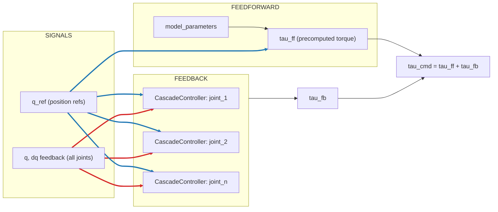
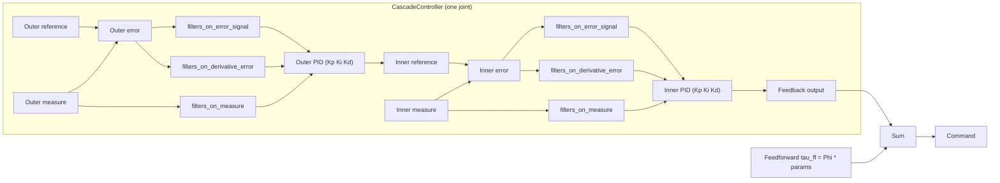

## Overview

This repository contains a collection of MATLAB classes used for the _Laboratorio di Automatica_ course at the [_Università degli Studi di Brescia_](https://www.unibs.it/it). The authors decline any responsibility for usage outside this scope. The provided tools support the development and implementation of control systems for mechatronic applications.
Developed by [CARI JRL](https://cari.unibs.it/).

## Build Status


## Table of Contents
- [Overview](#overview)
- [Key Features](#key-features)
  - [Filter Classes](#filter-classes)
  - [Controller Classes](#controller-classes)
  - [Motion Law](#motion-law)
- [Robot Model Structure](#robot-model-structure)
- [Simulation](#simulation)
- [Python Scripts](#python-scripts)
- [MATLAB Scripts](#matlab-scripts)
- [Testing & Debugging](#python-scripts-for-testing-and-debugging)
- [Installation](#installation)
- [Usage in MATLAB](#usage_in_matlab)

## Key Features

### Filter Classes

- **BaseFilter:** [Base class for filter implementations, providing common functionalities](docs/base_filter.md).
- **FirstOrderLowPassFilter:** [Discrete-time first-order low-pass filter for signal conditioning](docs/first_order_low_pass_filter.md).
- **NotchFilter:** [Discrete-time notch filter for mitigating specific frequency components](docs/notch_filter.md).
- **FIRFilter:** [Discrete-time Finite Impulse Response (FIR) filter for smoothing signals](docs/fir_filter.md).
- **Delay:** [Discrete-time fixed delay](docs/delay.md).

### Controller Classes

- **BaseController:** [Abstract class for designing control laws in mechatronic systems](docs/base_controller.md).
- **PIDController:** [Proportional-Integral-Derivative controller with customizable gains and filtering options](docs/pid_controller.md).
- **CascadeController:** [Cascade control structure combining inner and outer controllers for improved performance](docs/cascade_controller.md).
- **DecentralizedController:** [Decentralized control structure with precomputed torque](docs/decentralized_controller.md).


### Motion Law

- **MotionLaw:** Abstract class for computing motion law and performing a list of instructions.
- **TrapezoidalMotionLaw:** Class for computing trapezoidal motion law.

# Robot Model Structure
Each robot folder (e.g., `Scara0/`) should contain these files.
- **model.xml** - Description of the robot.
- **control_config.yaml** - Control parameters.
- **initial_control_config.yaml** - Initial values of the control parameters (used in identification phase)
- **trajectory.txt** - part program in custom format or **trajectory.gcode** part program in GCode format
- **tests/** subfolder to store the results. 

# Control Structure

The `DecentralizedController` class is designed for controlling a multi-joint rigid body robot.

The controller compute a feedforward action (precomputed torque) using a rigid model, and it has a `CascadeController`

```mermaid
flowchart LR
  %% ----------- External signals -----------
  
  %% ----------- Decentralized controller (multi-joint) -----------
  
  subgraph DCSIN["SIGNALS"]
    direction TB
    QREF["q_ref (position refs)"]
    QFB["q, dq feedback (all joints)"]
  end
    
  subgraph FFW["FEEDFORWARD"]
    direction TB
    TAU_FF["tau_ff (precomputed torque)"]
    PARAMS["model_parameters"] --> TAU_FF
  end

  subgraph DCIN["FEEDBACK"]
    direction TB
    C1["CascadeController: joint_1"]
    C2["CascadeController: joint_2"]
    CN["CascadeController: joint_n"]
  end

  QREF --> C1
  QFB --> C1
  QREF --> C2
  QFB --> C2
  QREF --> CN
  QFB --> CN

  DCIN --> TAU_FB["tau_fb"]

  %% ----------- Feedforward model (outside controller) -----------
  QREF --> TAU_FF

  %% ----------- Sum + plant -----------
  TAU_FF --> SUM["tau_cmd = tau_ff + tau_fb"]
  TAU_FB --> SUM

  %% ---- link coloring (0-based, in declaration order) ----
  %% 0: PARAMS --> TAU_FF  (leave default)
  linkStyle 1 stroke:#1f77b4,stroke-width:3px;   
  %% QREF --> C1
  linkStyle 2 stroke:#d62728,stroke-width:3px;   
  %% QFB --> C1
  linkStyle 3 stroke:#1f77b4,stroke-width:3px;   
  %% QREF --> C2
  linkStyle 4 stroke:#d62728,stroke-width:3px;   
  %% QFB --> C2
  linkStyle 5 stroke:#1f77b4,stroke-width:3px;   
  %% QREF --> CN
  linkStyle 6 stroke:#d62728,stroke-width:3px;   
  %% QFB --> CN
  %% 7: DCIN --> TAU_FB    (leave default)
  linkStyle 8 stroke:#1f77b4,stroke-width:3px;   
  %% QREF --> TAU_FF
  %% 9: TAU_FF --> SUM     (leave default)
  %% 10: TAU_FB --> SUM    (leave default)
```

for each joint. `CascadeController` has a outer controller to control joint position and a inner controller to control 
velocity.



```mermaid
flowchart LR
  subgraph J["CascadeController (one joint)"]
    r_out["Outer reference"] --> e_out["Outer error"]
    y_out["Outer measure"] --> e_out

    e_out --> Fes["filters_on_error_signal"]
    y_out --> Fm["filters_on_measure"]
    e_out --> Fde["filters_on_derivative_error"]

    Fes --> PIDo["Outer PID (Kp Ki Kd)"]
    Fm  --> PIDo
    Fde --> PIDo

    PIDo --> r_in["Inner reference"]

    r_in --> e_in["Inner error"]
    y_in["Inner measure"] --> e_in

    e_in --> Fes2["filters_on_error_signal"]
    y_in --> Fm2["filters_on_measure"]
    e_in --> Fde2["filters_on_derivative_error"]

    Fes2 --> PIDi["Inner PID (Kp Ki Kd)"]
    Fm2  --> PIDi
    Fde2 --> PIDi

    PIDi --> u_fb["Feedback output"]
  end

  u_ff["Feedforward tau_ff = Phi * params"] --> sum["Sum"]
  u_fb --> sum
  sum --> u_cmd["Command"]
```

### Control parameters
Control parameters are described as follows:
```yaml
controller:
  cascade_controllers:
    - name: joint1
      inner:
        Kp: 25.0
        Ki: 2.0
        Kd: 0.1
        filters_on_derivative_error:
          - type: FirstOrderLowPassFilter
            time_constant: 0.01
          - type: NotchFilter
            natural_frequency: 60.0
            zeros_damping: 0.05
            poles_damping: 0.2
      outer:
        Kp: 5.0
        Ki: 0.0
        Kd: 0.0
        filters_on_measure:
          - type: FIRFilter
            coefficients: [0.25, 0.5, 0.25]
        filters_on_error_signal:
          - type: FirstOrderLowPassFilter
            time_constant: 0.02
    - name: joint2
      inner:
        Kp: 35.0
        Ki: 2.0
        Kd: 0.1
        filters_on_derivative_error:
          - type: FirstOrderLowPassFilter
            time_constant: 0.01
          - type: NotchFilter
            natural_frequency: 60.0
            zeros_damping: 0.05
            poles_damping: 0.2
      outer:
        Kp: 5.0
        Ki: 0.0
        Kd: 0.0
        filters_on_measure:
          - type: FIRFilter
            coefficients: [0.25, 0.5, 0.25]
        filters_on_error_signal:
          - type: FirstOrderLowPassFilter
            time_constant: 0.02
model_parameters:
  - 0.0
  - 0.0
  # ...
```

see [here](docs/configuration.md) for more details.

## Simulation
- **mechanical_system.py** - Abstract class for simulating mechanical systems.
- **mujoco_robotic_system.py** - Simulates a robot with flexible joints using the Spong model. Reads [MJCF](https://mujoco.readthedocs.io/en/stable/modeling.html) and config from a folder.


## Installation

### WINDOWS
Install [Conda](https://repo.anaconda.com/archive/Anaconda3-2024.10-1-Windows-x86_64.exe) with Python 3.12  (other versions could work, check Matlab Python compatibility [here](https://it.mathworks.com/support/requirements/python-compatibility.html)

In _anaconda prompt_ run:

```conda install pinocchio -c conda-forge```

locate the executable with

```where python```

If you got the error **LookupError('unknown encoding: uf-16-le')** run:

```
set PYTHONUTF8=1
conda install pinocchio -c conda-forge
```

### UBUNTU
install python3 and python3-pip (check Matlab Python compatibility [here](https://it.mathworks.com/support/requirements/python-compatibility.html) then run
```pip3 install pinocchio```

locate the executable with

```which python```

## Usage in MATLAB
Execute the script ```configure_python``` at the matlab startup
