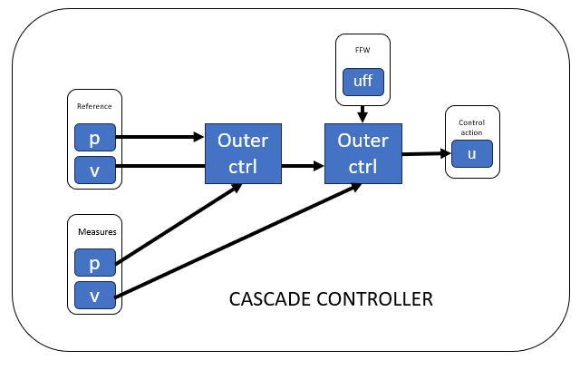

## Overview

This repository contains a collection of MATLAB classes used for the _Laboratorio di Automatica_ course at the [_Università degli Studi di Brescia_](https://www.unibs.it/it). The authors decline any responsibility for usage outside this scope. The provided tools support the development and implementation of control systems for mechatronic applications. 
Developed by [CARI JRL](https://cari.unibs.it/).

## Build Status


## Table of Contents
- [Overview](#overview)
- [Key Features](#key-features)
  - [Controller Classes](#controller-classes)
  - [Filter Classes](#filter-classes)
  - [Motion Law](#motion-law)
- [Robot Model Structure](#robot-model-structure)
- [Simulation](#simulation)
- [Python Scripts](#python-scripts)
- [MATLAB Scripts](#matlab-scripts)
- [Testing & Debugging](#python-scripts-for-testing-and-debugging)
- [Installation](#installation)

## Key Features

### Controller Classes

- **BaseController:** Abstract class for designing control laws in mechatronic systems.
- **PIDController:** Proportional-Integral-Derivative controller with customizable gains and filtering options.
- **CascadeController:** Cascade control structure combining inner and outer controllers for improved performance.
  
  

- **DecentralizedController:** Decentralized control structure with precomputed torque.
  
  

### Filter Classes

- **NotchFilter:** Discrete-time notch filter for mitigating specific frequency components.
- **FirstOrderLowPassFilter:** Discrete-time first-order low-pass filter for signal conditioning.
- **FIRFilter:** Discrete-time Finite Impulse Response (FIR) filter for smoothing signals.
- **BaseFilter:** Base class for filter implementations, providing common functionalities.

### Motion Law

- **MotionLaw:** Abstract class for computing motion law and performing a list of instructions.
- **TrapezoidalMotionLaw:** Class for computing trapezoidal motion law.

## Robot Model Structure
- **model.urdf** - Description of the robot.
- **config.yaml** - Description of flexible joints (motor inertia, friction, stiffness, and damping).
- **control_config.yaml** - Control parameters.

Each robot folder (e.g., `Scara0/`) should contain these three files.

## Simulation
- **mechanical_system.py** - Abstract class for simulating mechanical systems.
- **pinocchio_robotic_system.py** - Simulates a robot with flexible joints using the Spong model. Reads URDF and config from a folder. [slide 15 of this lecture](http://www.diag.uniroma1.it/deluca/EECI-IGSC-2023-M16_Lecture_Flexible_Joints_ADL.pdf)

## Python Scripts
- **robot_simulation.py** - Run a simulation of the robot performing a list of instructions.
- **identification_experiment.py** - Run a chirp identification experiment on the robot in a working point.
- **validation_experiment.py** - Run randomized chirp validation experiments on the robot in a working point.
- **validation_experiments_working_points.py** - Run chirp validation experiments on the robot in multiple working points.

## MATLAB Scripts
- **IdentificazioneGiunto1.mlx** - Identification of joint 1.
- **IdentificazioneGiunto2.mlx** - Identification of joint 2.
- **ValidazioneGiunto.m** - Validation in the same working point.
- **ValidazioneSpazioLavoro.m** - Validation in multiple working configurations.

## Python Scripts for Testing and Debugging
- **test_notch_filter.py** - Run tests on the notch filter.


## Installation

### WINDOWS
Install [Conda](https://repo.anaconda.com/archive/Anaconda3-2024.10-1-Windows-x86_64.exe) with Python 3.12  (other versions could work, check Matlab Python compatibility [here](https://it.mathworks.com/support/requirements/python-compatibility.html)

In _anaconda prompt_ run:

```conda install pinocchio -c conda-forge```

locate the executable with

```where python```

If you got the error **LookupError('unknown encoding: uf-16-le')** run:

```
set PYTHONUTF8=1
conda install pinocchio -c conda-forge
```

### UBUNTU
install python3 and python3-pip (check Matlab Python compatibility [here](https://it.mathworks.com/support/requirements/python-compatibility.html) then run
```pip3 install pinocchio```

locate the executable with

```which python```

