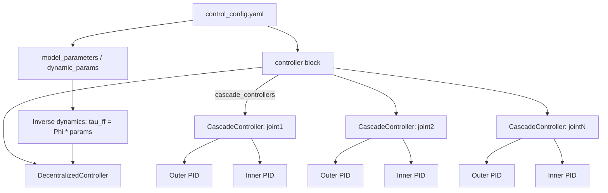

# control_config YAML schema (loader expectations)

This document describes the YAML structure expected by the configuration loader, derived from the functions:

- `loadController`
- `loadCascade`
- `loadPid`
- `loadFilters`

---

## Top-level structure

The loader consumes **two parameter objects**:

- **`controller_params`** → must contain `cascade_controllers` (and may contain other fields used elsewhere, e.g., motion law)
- **`dynamic_params`** → the numeric vector passed into inverse dynamics (`Phi @ params`)

In YAML, these map to:

```yaml
controller:               # -> controller_params
  motion_law_parameters:  # optional for this loader (used by motion_law)
  cascade_controllers:    # -> controller_params['cascade_controllers']

model_parameters:         # -> dynamic_params
```

---

## `controller` block

### `controller.motion_law_parameters` (required by`MotionLaw`)

It is read by motion-profile generators derived from `MotionLaw`:

```yaml
controller:
  motion_law_parameters:
    max_velocity: [0.5, 0.5, 0.5]
    max_acceleration: [0.1, 0.1, 0.1]
```


### `controller.cascade_controllers` (required by `loadController`)

A list. Each element instantiates a `CascadeController`. All cascade controllers are collected into one `DecentralizedController`.

Each element must contain:

- `name` *(string)* — used only for printing/logging
- `inner` *(PID block)*
- `outer` *(PID block)*

Example:

```yaml
controller:
  cascade_controllers:
    - name: "joint1"
      inner:
        Kp: 25.0
        Ki: 2.0
        Kd: 0.0
      outer:
        Kp: 5.0
        Ki: 0.0
        Kd: 0.0
```

---

## PID block format (`inner` / `outer`)

Each PID block must contain numeric gains:

- `Kp: <float>`
- `Ki: <float>`
- `Kd: <float>`

Each PID block may also include **optional filter lists**. The loader checks *exactly* these keys:

- `filters_on_derivative_error`
- `filters_on_measure`
- `filters_on_error_signal`

If any key is missing, the loader defaults it to an **empty list**.

A fully populated PID block looks like:

```yaml
inner:
  Kp: 25.0
  Ki: 2.0
  Kd: 0.1

  filters_on_derivative_error:
    - { ... filter spec ... }
    - { ... }

  filters_on_measure:
    - { ... }

  filters_on_error_signal:
    - { ... }
```

---

## Filter specification format (`loadFilters`)

Each filter entry is a mapping (dict) with a required `type` plus type-specific parameters.

### 1) `FirstOrderLowPassFilter`

Required keys:

- `type: "FirstOrderLowPassFilter"`
- `time_constant: <float>`

Example:

```yaml
- type: FirstOrderLowPassFilter
  time_constant: 0.02
```

### 2) `NotchFilter`

Required keys:

- `type: "NotchFilter"`
- `natural_frequency: <float>` *(passed as `wn=...`)*
- `zeros_damping: <float>` *(passed as `xi_z=...`)*
- `poles_damping: <float>` *(passed as `xi_p=...`)*

Example:

```yaml
- type: NotchFilter
  natural_frequency: 50.0
  zeros_damping: 0.05
  poles_damping: 0.2
```

### 3) `FIRFilter`

Required keys:

- `type: "FIRFilter"`
- `coefficients: [c0, c1, ..., cN]` *(list of numbers)*

Example:

```yaml
- type: FIRFilter
  coefficients: [0.2, 0.6, 0.2]
```

### Unsupported filters

If `type` is anything else, the loader prints:

- `Type X is not supported`

…and **skips** that filter (no exception is raised). The controller still loads, but that filter is not applied.

---

## `model_parameters` / dynamics vector

At top level:

```yaml
model_parameters:
  - 0.0
  - 0.0
  - ...
```

This is passed as `dynamic_params` into the inverse dynamics term:

- `return Phi @ params`

So `model_parameters` must be a numeric vector whose length matches:

- the number of columns in `Phi_dynamic = computeJointTorqueRegressor(...)`, **plus**
- the friction columns appended via `np.hstack((diag_dq, diag_sign_dq))`, which contribute **`2 * dof`** additional parameters.

The example file uses a long list of zeros as a placeholder.

---

## Minimal vs full examples

### Minimal (no filters)

```yaml
controller:
  cascade_controllers:
    - name: joint1
      inner: { Kp: 25.0, Ki: 2.0, Kd: 0.0 }
      outer: { Kp: 5.0,  Ki: 0.0, Kd: 0.0 }

model_parameters: [0.0, 0.0, 0.0]  # length must match your regressor+friction parameterization
```

### With filters (all three lists shown)

```yaml
controller:
  cascade_controllers:
    - name: joint1
      inner:
        Kp: 25.0
        Ki: 2.0
        Kd: 0.1
        filters_on_derivative_error:
          - type: FirstOrderLowPassFilter
            time_constant: 0.01
          - type: NotchFilter
            natural_frequency: 60.0
            zeros_damping: 0.05
            poles_damping: 0.2
      outer:
        Kp: 5.0
        Ki: 0.0
        Kd: 0.0
        filters_on_measure:
          - type: FIRFilter
            coefficients: [0.25, 0.5, 0.25]
        filters_on_error_signal:
          - type: FirstOrderLowPassFilter
            time_constant: 0.02

model_parameters:
  - 0.0
  - 0.0
  # ...
```


## Schema
```yaml
# control_config.yaml — compact schema (required/optional)

controller:                                  # required (for controller loader)
  motion_law_parameters:                     # required (from MotionLaw)
    max_velocity: <list<float>>              # required
    max_acceleration: <list<float>>          # required

  cascade_controllers:                       # required: list[ CascadeControllerSpec ]
    - name: <string>                         # required (logging/identification)
      inner:                                 # required: PIDSpec
        Kp: <float>                          # required
        Ki: <float>                          # required
        Kd: <float>                          # required

        filters_on_derivative_error:         # optional: list[ FilterSpec ] (default [])
          - <FilterSpec>
        filters_on_measure:                  # optional: list[ FilterSpec ] (default [])
          - <FilterSpec>
        filters_on_error_signal:             # optional: list[ FilterSpec ] (default [])
          - <FilterSpec>

      outer:                                 # required: PIDSpec (same fields as inner)
        Kp: <float>                          # required
        Ki: <float>                          # required
        Kd: <float>                          # required

        filters_on_derivative_error:         # optional: list[ FilterSpec ] (default [])
          - <FilterSpec>
        filters_on_measure:                  # optional: list[ FilterSpec ] (default [])
          - <FilterSpec>
        filters_on_error_signal:             # optional: list[ FilterSpec ] (default [])
          - <FilterSpec>

# Inverse-dynamics / regressor parameter vector
model_parameters:                            # required: list[float]
  - <float>                                  # length must match (Phi columns + 2*dof friction params)
  - <float>
  - ...

# -----------------------------
# FilterSpec (allowed types)
# -----------------------------

# 1) FirstOrderLowPassFilter
# required keys: type, time_constant
# - type: FirstOrderLowPassFilter
#   time_constant: <float>

# 2) NotchFilter
# required keys: type, natural_frequency, zeros_damping, poles_damping
# - type: NotchFilter
#   natural_frequency: <float>
#   zeros_damping: <float>
#   poles_damping: <float>

# 3) FIRFilter
# required keys: type, coefficients
# - type: FIRFilter
#   coefficients: [<float>, <float>, ...]
```



