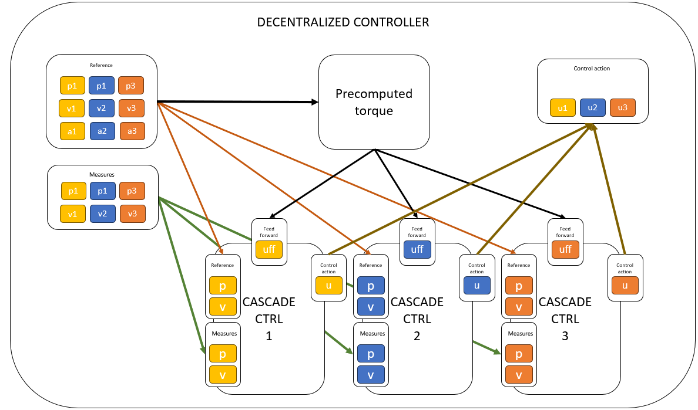

# DecentralizedController - Multi-Joint Robot Controller

## Overview
The `DecentralizedController` class is designed for controlling a multi-joint rigid body robot.




## Constructor
```python
DecentralizedController(Tc: float, joint_ctrls: list, inverse_dynamics_fcn=None)
```
### Parameters:
- `Tc` (float): Sampling time, must be a positive scalar.
- `joint_ctrls` (list): List of controllers for each joint (instances of `BaseController`).
- `inverse_dynamics_fcn` (callable, optional): Function for computing inverse dynamics.

## Methods
### `initialize()`
Resets all inner controllers.

### `set_umax(umax: list)`
Sets the maximum control action per joint.

### `starting(reference: np.ndarray, y: np.ndarray, u: np.ndarray, uff: np.ndarray)`
Initializes the controllers with reference values, state, control action, and feedforward input.

### `compute_control_action(reference: np.ndarray, y: np.ndarray, uff: np.ndarray) -> np.ndarray`
Computes the control action based on the reference, system state, and feedforward input.

## Example Usage
```python
import numpy as np
from decentralized_controller import DecentralizedController
from cascade_controller import CascadeController
from pid_controller import PIDController

# Create inner and outer PID controllers for each joint
inner_ctrl1 = PIDController(Tc=0.01, Kp=1.5, Ki=0.2, Kd=0.1)
outer_ctrl1 = PIDController(Tc=0.01, Kp=2.0, Ki=0.3, Kd=0.15)
inner_ctrl2 = PIDController(Tc=0.01, Kp=1.8, Ki=0.25, Kd=0.12)
outer_ctrl2 = PIDController(Tc=0.01, Kp=2.2, Ki=0.35, Kd=0.18)

# Create cascade controllers for each joint
joint1_ctrl = CascadeController(Tc=0.01, inner_ctrl=inner_ctrl1, outer_ctrl=outer_ctrl1)
joint2_ctrl = CascadeController(Tc=0.01, inner_ctrl=inner_ctrl2, outer_ctrl=outer_ctrl2)

# Define inverse dynamics function
def inverse_dynamics(q, dq, ddq):
    return np.array([0.5 * ddq[0], 0.7 * ddq[1]])

# Create a decentralized controller
controller = DecentralizedController(Tc=0.01, joint_ctrls=[joint1_ctrl, joint2_ctrl], inverse_dynamics_fcn=inverse_dynamics)

# Initialize the controller
controller.initialize()

# Set initial conditions
reference = np.array([1.0, 0.5, 0.0, 0.0, 0.0, 0.0])
y = np.array([0.8, 0.3, 0.1, 0.05])
u = np.array([0.0, 0.0])
uff = np.array([0.0, 0.0])
controller.starting(reference, y, u, uff)

# Compute a control action
control_output = controller.compute_control_action(reference, y, uff)
print("Control Output:", control_output)
```

## License
This project is open-source and can be used freely for research and development purposes.
