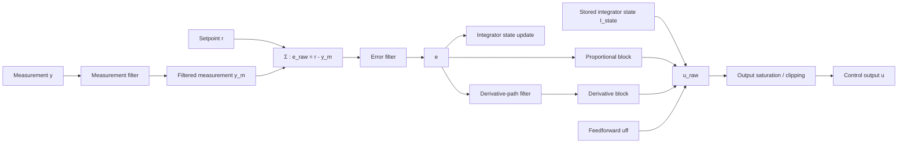

# PIDController - Proportional-Integral-Derivative (PID) Controller

## Overview
The `PIDController` class implements a Proportional-Integral-Derivative (PID) controller.


## Constructor
```python
PIDController(Tc: float, Kp: float, Ki: float, Kd: float,
              filters_on_derivative_error=None, filters_on_error_signal=None, filters_on_measure=None)
```
### Parameters:
- `Tc` (float): Sampling time (must be a positive scalar).
- `Kp` (float): Proportional gain (must be non-negative).
- `Ki` (float): Integral gain (must be non-negative).
- `Kd` (float): Derivative gain (must be non-negative).
- `filters_on_derivative_error`: Optional filter for the derivative of the error.
- `filters_on_error_signal`: Optional filter for the error signal.
- `filters_on_measure`: Optional filter for the measurement.

## Methods
### `initialize()`
Resets the internal state variables.

### `starting(reference: float, y: float, u: float, uff: float)`
Initializes the controller state based on the given input conditions.

### `compute_control_action(reference: float, y: float, uff: float) -> float`
Computes the control action based on the error, setpoint, and feedforward input.

## Example Usage
```python
from pid_controller import PIDController

# Create a PID controller with specific gains
controller = PIDController(Tc=0.01, Kp=1.2, Ki=0.5, Kd=0.3)

# Initialize the controller
controller.initialize()

# Set initial conditions
controller.starting(reference=1.0, y=0.5, u=0.2, uff=0.0)

# Compute a control action
control_output = controller.compute_control_action(reference=1.0, y=0.6, uff=0.0)
print("Control Output:", control_output)
```

## License
This project is open-source and can be used freely for research and development purposes.
